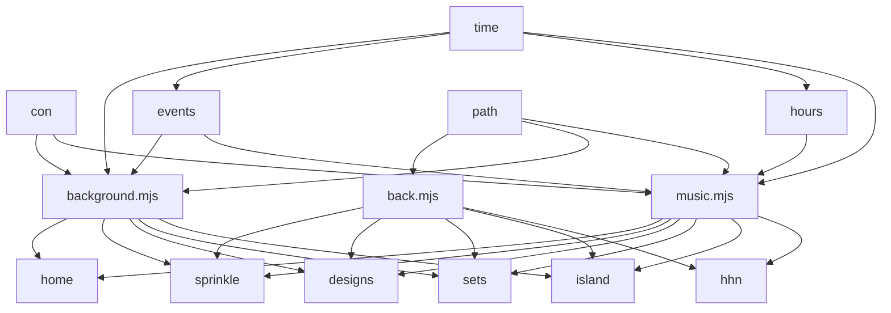
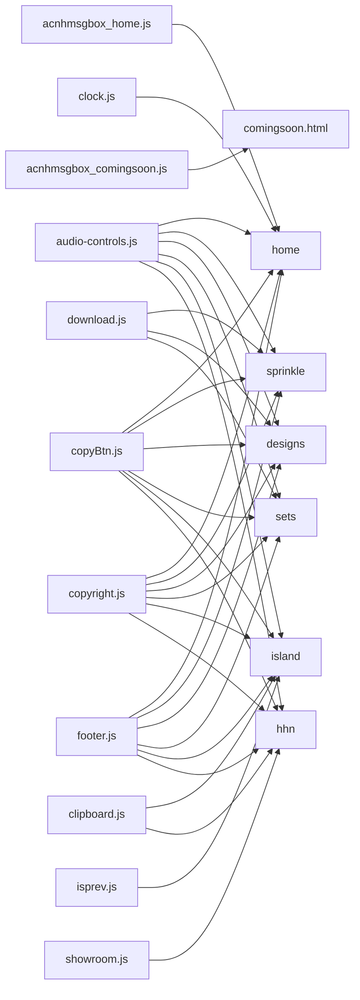

# Reper2's ACNH Website
>   
> Reper2's Animal Crossing: New Horizons website. Includes: complete album of Reper2's acnh photos & videos, hhn showroom, all of Reper2's custom designs (as well as design sets), preview of Reper2's island, Sprinkle order files, and other links to profiles & etc.
> 

# Features:
- 350+ backgrounds (that change to a different background every time you refresh the page)
- evently backgrounds for many events that are held in acnh
- hourly & evently music just like in the game
- message box like in acnh (using acnhmsgbox npm library)
- And much more...

# NookPhone Apps:
Some of these may still be under construction.
- **Album**: download the complete album of my acnh screenshots & videos
- **DodoCodes Profile**: my DodoCodes.com profile
- **Sprinkle Order Files**: download my Sprinkle order files
- **ACNH Apps**: Animal Crossing New Horizons Apps is a website with useful apps for you to use
- **Nookazon Profile**: my Nookazon profile
- **GitHub Repository**: link to this GitHub repository
- **Custom Designs, Design Sets**: my Custom Designs and Design Sets
- **Island Preview**: preview of my island
- **Happy Home Network Gallery**: my Happy Home Network gallery

# Dependencies & Submodules
These are the npm libraries and github submodules that make up part of the website or are invloved in the development.

## Dependencies
- [acnhmsgbox][acnhmsgbox]

## DevDependencies
- [http-server][http-server]

## Submodules
- [acnhmsgbox][acnhmsgbox]

[View Dependencies](./package.json)  
[View Submodules](./.gitmodules)

# Modules
| Module | Description | Imports | Exports | Used By
| :---: | :---: | :---: | :---: | :---:
| [back.mjs][back] | Creates a back button in top-left corner of the page. | [`path`][path] | | [sprinkle][sprinkle], [designs][designs], [sets][sets], [island][island], [hhn][hhn]
| [background.mjs][bg] | Randomised backgrounds including evently backgrounds for some acnh events. | [`time`][time], [`con`][con], [`events`][events], [`hours`][hours] | | [home][home], [sprinkle][sprinkle], [designs][designs], [sets][sets], [island][island]
| [`con`][con] | Common console messages. | | { `cur`, `tdy`, `bg` } | [music.mjs][mus], [background.mjs][bg]
| [`events`][events] | ACNH event dates. | [`time`][time] | { `intlmusday`, `maydaytour`, `wedseas`, `winter`, `bday`, `halloween`, `toyday`, `nye`, `nye_1h`, `nye_30m`, `nye_10m`, `nye_5m`, `nye_hny`, `nye_midn` } | [music.mjs][mus], [background.mjs][bg]
| [`hours`][hours] | Hours of the day. | [`time`][time] | { `am_12`, `am_01`, `am_02`, `am_03`, `am_04`, `am_05`, `am_06`, `am_07`, `am_08`, `am_09`, `am_10`, `am_11`, `pm_12`, `pm_01`, `pm_02`, `pm_03`, `pm_04`, `pm_05`, `pm_06`, `pm_07`, `pm_08`, `pm_09`, `pm_10`, `pm_11` } | [music.mjs][mus], [background.mjs][bg]
| [music.mjs][mus] | Hourly and evently music just like in acnh. | [`time`][time], [`con`][con], [`events`][events], [`hours`][hours] | | [home][home], [sprinkle][sprinkle], [designs][designs], [sets][sets], [island][island], [hhn][hhn]
| [`path`][path] | File path control center for scripts. | | { `b`, `bg`, `bg_n`, `mus`, `mus_e`, `mus_n`, `mus_h`, `mus_s` } | [music.mjs][mus], [background.mjs][bg], [back.mjs][back]
| [`time`][time] | Common time variables. | | { `tdy`, `Y`, `M`, `d`, `D`, `h`, `m`, `s`, `ms`, `t`, `Y_M_d_t_s_ms__t`, `D_h`, `D_t` } | [music.mjs][mus], [background.mjs][bg], [`events`][events], [`hours`][hours]

    
Show Graph

---

# Normal Scripts
These are the regular scripts that make up the website without the imports or exports of modules.
| Script | Description | Used By |
| :---: | :---: | :---: |
| [acnhmsgbox_home.js][msgbox_home] | Creates the message box like in acnh on the home page using [acnhmsgbox][acnhmsgbox]. | [home][home]
| [acnhmsgbox_comingsoon.js][msgbox_comingsoon] | Creates a message box like in acnh on the Coming Soon page using [acnhmsgbox][acnhmsgbox]. | [comingsoon.html][comingsoon]
| [audio-controls.js][audctrls] | Creates shows/hide button that allows you to show or hide audio controls for accessability when autoplay doesn't work. | [home][home], [sprinkle][sprinkle], [designs][designs], [sets][sets], [island][island], [hhn][hhn]
| [clipboard.js][clipboard] | Enables copying of a link to a section on the page via the `copyLink()` function. | [island][island], [hhn][hhn]
| [clock.js][clock] | Displays the current time on the NookPhone. | [home][home]
| [copyBtn.js][copyBtn] | Creates a button that copys the link to the page. | [home][home], [sprinkle][sprinkle], [designs][designs], [sets][sets], [island][island], [hhn][hhn]
| [copyright.js][copyright] | Adds copyright information to the bottom of the page. | [home][home], [sprinkle][sprinkle], [designs][designs], [sets][sets], [island][island], [hhn][hhn] 
| [download.js][download] | Download confirmation for the file in context. | [sprinkle][sprinkle], [designs][designs], [sets][sets]
| [footer.js][footer] | Adds the footer to the page. | [home][home], [sprinkle][sprinkle], [designs][designs], [sets][sets], [island][island], [hhn][hhn]
| [isprev.js][isprev] | The script for the [Island Preview][island] page. | [island][island]
| [showroom.js][showroom] | The script for the [HHN Showroom][hhn] page. | [hhn][hhn]

    
Show Graph

---

[home]: [./index.html]
[sprinkle]: [./sprinkle/index.html]
[designs]: [./designs/index.html]
[sets]: [./designs/sets/index.html]
[island]: [./island/index.html]
[hhn]: [./hhn/index.html]
[comingsoon]: [./comingsoon.html]

[back]: [./scripts/modules/back.mjs]
[bg]: [./scripts/modules/backgrounds.mjs]
[con]: [./scripts/modules/console.mjs]
[events]: [./scripts/modules/events.mjs]
[hours]: [./scripts/modules/hours.mjs]
[mus]: [./scripts/modules/music.mjs]
[path]: [./scripts/modules/path.mjs]
[time]: [./scripts/modules/time.mjs]

[msgbox_home]: [./scripts/acnhmsgbox_home.js]
[msgbox_comingsoon]: [./scripts/acnhmsgbox_comingsoon.js]
[audctrls]: [./scripts/audio-controls.js]
[clipboard]: [./scripts/clipboard.js]
[clock]: [./scripts/clock.js]
[copyBtn]: [./scripts/copyBtn.js]
[copyright]: [./scripts/copyright.js]
[download]: [./scripts/download.js]
[footer]: [./scripts/footer.js]
[isprev]: [./scripts/isprev.js]
[showroom]: [./scripts/showroom.js]

[acnhmsgbox]: [https://npmjs.com/package/acnhmsgbox]
[http-server]: [https://npmjs.com/package/http-server]