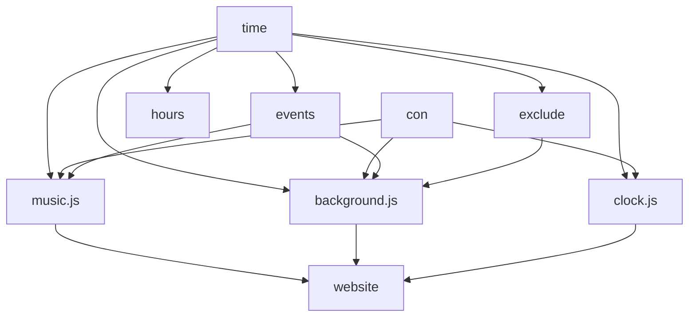

# Reper2's ACNH Website
>   
> Reper2's ACNH Website is a NookPhone which includes a download link to Reper2's acnh album, DodoCodes.com profile link, Sprinkle order files, Nookazon profile link, Custom Designs, Island Preview, Happy Home Network gallery, ACNH Apps. The same hourly and evently music from ACNH plays here too!
> 

# Features:
- 350+ backgrounds (that change to a different background every time you refresh the page)
- evently backgrounds for many events that are held in acnh
- hourly & evently music just like in the game
- message box like in acnh (using acnhmsgbox npm library)

# NookPhone Apps:
Some of these may still be under construction.
- Album: download the complete album of my acnh screenshots & videos
- DodoCodes Profile: my DodoCodes.com profile
- Sprinkle Order Files: download my Sprinkle order files
- ACNH Apps: Animal Crossing New Horizons Apps is a website with useful apps for you to use
- Nookazon Profile: my Nookazon profile
- GitHub Repository: link to this GitHub repository
- Custom Designs, Design Sets: my Custom Designs and Design Sets
- Island Preview: preview of my island
- Happy Home Network Gallery: my Happy Home Network gallery

# Dependencies & Submodules
These are the npm libraries that make up part of the website or are invloved in the development.
- [acnhmsgbox](https://npmjs.com/package/acnhmsgbox) - message box like in acnh
- [http-server](https://npmjs.com/package/http-server) - website testing [development]

[View Dependencies](./package.json)  
[View Submodules](./.gitmodules)

# Modules
| Module | Description | Imported Modules | Exported Variables, Functions, etc. | Used By
| :---: | :---: | :---: | :---: | :---:
| [music.js](./scripts/modules/music.js) | Hourly and evently music just like in acnh. | `time` `con` `events` `hours` | | [index.html (root)](./index.html)
| [background.js](./scripts/modules/background.js) | Randomised backgrounds including evently backgrounds for some acnh events. | `time` `con` `events` `hours` `exclude` | | [index.html (root)](./index.html)
| [clock.js](./scripts/modules/clock.js) | Sends the current time to console in the format, "It is currently `time.Y_M_d_t_s_ms__t`" | `time` `con` | | [index.html (root)](./index.html)
| [`time`](./scripts/modules/time.js) | Common time variables. | | `tdy` `Y` `M` `d` `D` `h` `m` `s` `ms` `t` `Y_M_d_t_s_ms__t` `D_h` `D_t` | [music.js](./scripts/modules/music.js), [background.js](./scripts/modules/background.js), [events.js](./scripts/modules/events.js), [hours.js](./scripts/modules/hours.js), [exclude.js](./scripts/modules/exclude.js)
| [`con`](./scripts/modules/console.js) | Variables for common console messages. | | `curr` `tdy` `bg`  | [music.js](./scripts/modules/music.js), [background.js](./scripts/modules/background.js)
| [`events`](./scripts/modules/events.js) | Variables for ACNH event dates. | `time` | `intlmus` `maydaytour` `wedseas` `bday` `h` `turkey` `toy` `nye` `nye_1h` `nye_30m` `nye_10m` `nye_5m` `nye_hny1` `nye_hny2` `nye_midn` | [music.js](./scripts/modules/music.js), [background.js](./scripts/modules/background.js)
| [`exclude`](./scripts/modules/exclude.js) | Makes sure regular backgrounds don't intervene with event backgrounds. | `time` | `isNotExcluded` | [background.js](./scripts/modules/background.js)
| [`hours`](./scripts/modules/hours.js) | Variables for each hour of the day. | `time` | `am_12` `am_01` `am_02` `am_03` `am_04` `am_05` `am_06` `am_07` `am_08` `am_09` `am_10` `am_11` `pm_12` `pm_01` `pm_02` `pm_03` `pm_04` `pm_05` `pm_06` `pm_07` `pm_08` `pm_09` `pm_10` `pm_11` | [music.js](./scripts/modules/music.js), [background.js](./scripts/modules/background.js)

# Normal Scripts
These are the regular scripts that make up the website without the imports or exports of modules.
| Script | Description
| :---: | :---:
| [acnhmsgbox.js](./scripts/acnhmsgbox.js) | Creates a message box like in acnh using [acnhmsgbox](https://npmjs.com/package/acnhmsgbox).
| [album.js](./scripts/album.js) | The `downloadAlbum()` function. When triggered, asks you to confirm you want to download the ginormous zip file that has my entire album of acnh screenshots and videos.
| [download.js](./scripts/download.js) | The `downloadFile(filename)` function. When triggered, asks you to confirm you want to download the file in context.
| [footer.js](./scripts/footer.js) | Appends the footer to the page.